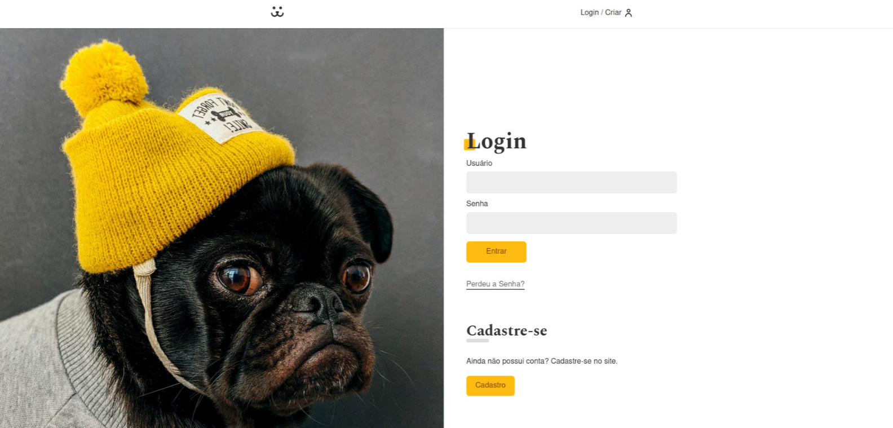
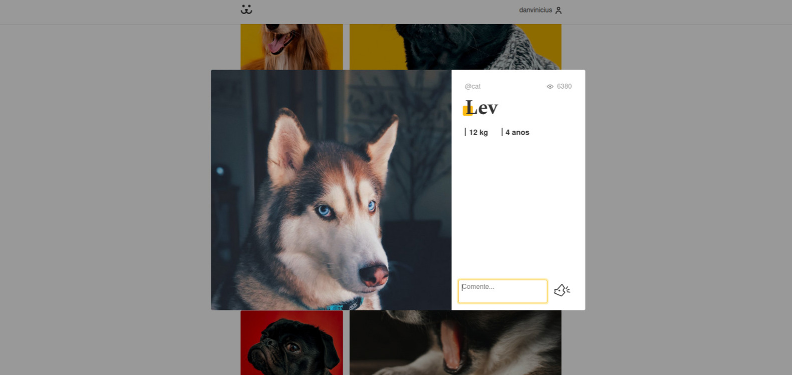
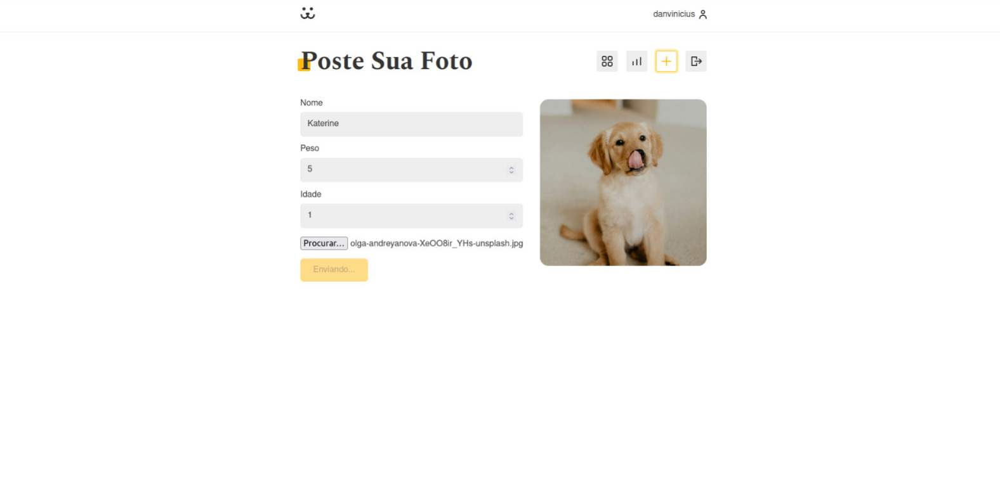
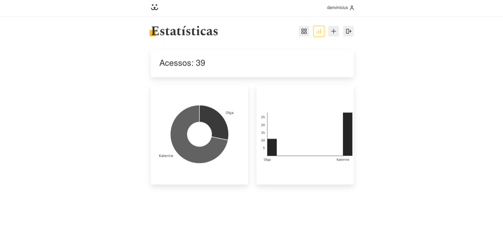

# Dogs

<h2>🔖 Descrição</h2>

🐕 Criação da aplicação Dogs, uma rede social para cachorros criada no curso de React da Origamid.

<h2>🚀 Tecnologias</h2>
<ul>
    <li><a href="https://create-react-app.dev/" target="_blank">React</a></li>
    <li><a href="https://reactrouter.com/" target="_blank">React Router</a></li>
    <li><a href="https://github.com/FormidableLabs/victory" target="_blank">Victory</a></li>
</ul>

<h2>ℹ️ Como utilizar</h2>

    Clone esse repositório
    $ git clone https://github.com/danvinicius/dogs.git

    Instalar dependências
    $ yarn install

    Inicie o projeto
    $ yarn dev

 
Criado por <a href="https://github.com/danvinicius/" target="_blank">Daniel Vinícius</a>

# React + Vite

This template provides a minimal setup to get React working in Vite with HMR and some ESLint rules.

Currently, two official plugins are available:

- [@vitejs/plugin-react](https://github.com/vitejs/vite-plugin-react/blob/main/packages/plugin-react/README.md) uses [Babel](https://babeljs.io/) for Fast Refresh
- [@vitejs/plugin-react-swc](https://github.com/vitejs/vite-plugin-react-swc) uses [SWC](https://swc.rs/) for Fast Refresh
